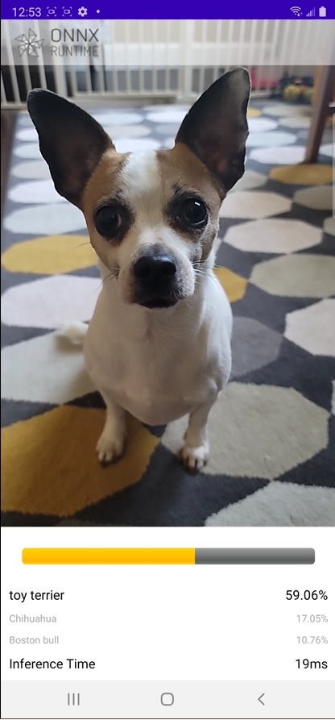

An Android image classification app using [Onnx Runtime Mobile](https://github.com/microsoft/onnxruntime) and [MobileNet V1](https://1drv.ms/u/s!Auaxv_56eyubgQOFsABIxjFVo93t?e=6fAkBx)

This example is loosely based on [Google CodeLabs - Getting Started with CameraX](https://codelabs.developers.google.com/codelabs/camerax-getting-started)

# Build Instructions
## Requirements
- Android SDK 29+
- Android NDK r21+

Download the MobileNet V1 model and label and put them under `app/src/main/res/raw/`

Build the Onnx Runtime for Android arm64 (see [Build Instruction](https://www.onnxruntime.ai/docs/how-to/build.html#android)), and copy the `onnxruntime-release-1.7.0.aar` under `app/libs`

