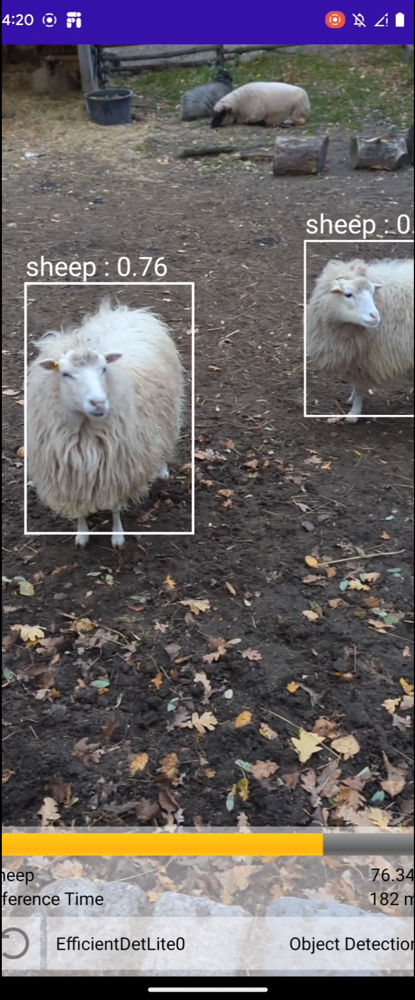
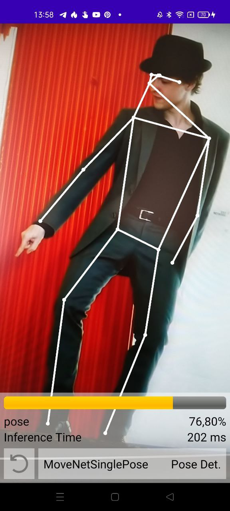
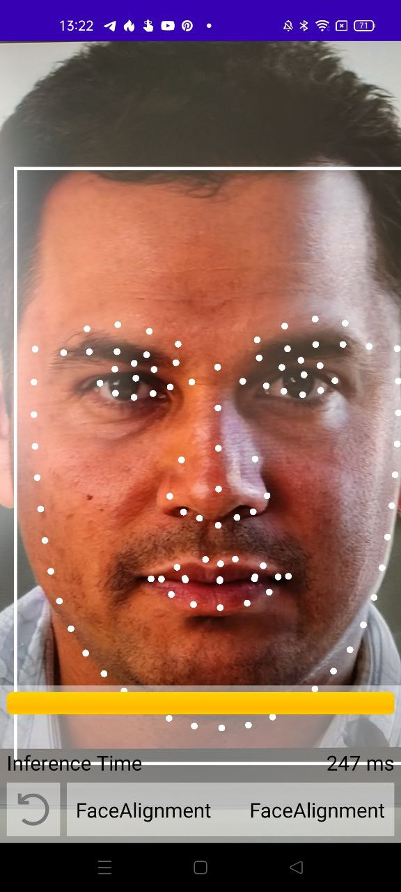

##  KotlinDL Android inference demo application 

||||
| ---------- | ----------- | ----------- |
|       |        |  |

This repo demonstrates how to use KotlinDL for neural network inference on Android devices.
It contains a simple Android app that uses KotlinDL to demonstrate the inference of a bunch of pre-trained models for different computer vision tasks.

The list of demonstrated models includes:
* MobileNetV1 and EfficientNetV4Lite for image classification
* SSDMobileNetV1 and EfficientDetLite0 for object detection
* MoveNet for human pose estimation
* UltraFace320 for Face detection
* Fan2d106Face for Face Alignment

This application is based on CameraX Android API and uses the latest KotlinDL version.
The actual model inference is performed by the [Onnx Runtime](https://github.com/microsoft/onnxruntime).

This example is based on [ort_image_classification example](https://github.com/guoyu-wang/ort_image_classification_android)
